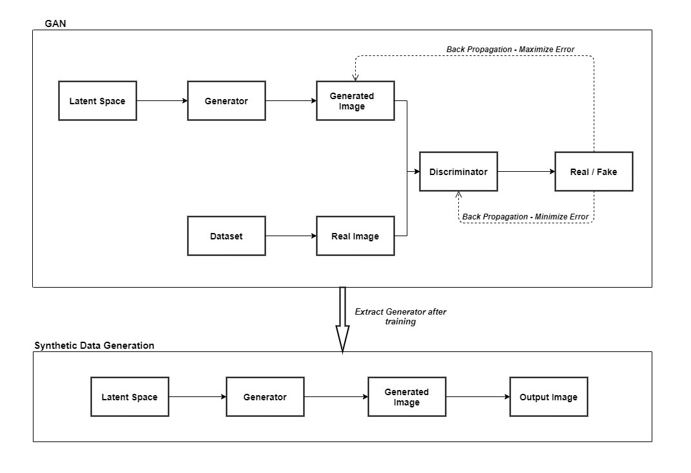
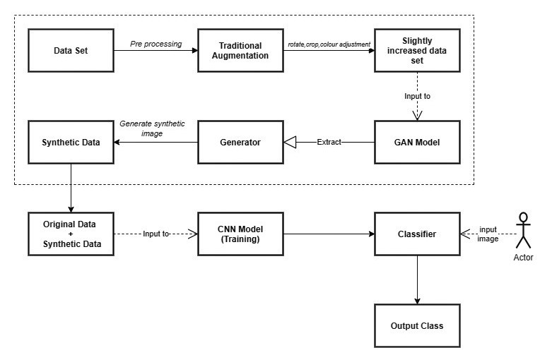
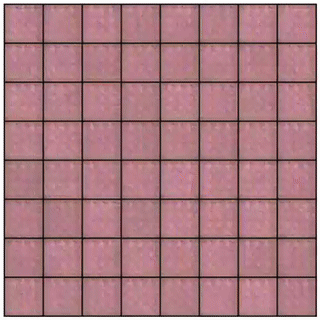
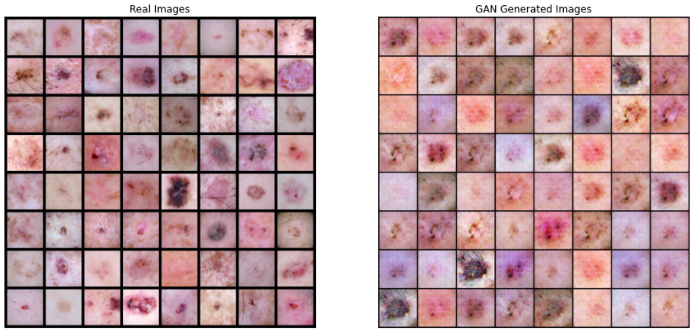

# DCGAN for Skin Lesion Data Augmentation

This project implements a Deep Convolutional Generative Adversarial Network (DCGAN) to augment an imbalanced skin lesion image dataset. The goal is to generate high-quality synthetic images that can be used to increase the performance of Convolutional Neural Networks (CNNs) in classifying skin lesions, especially for classes with limited data.

This work is based on the research presented in the following papers:

* Bhavsar, S., Bhalerao, A., Balkawade, S., Chintawar, S., & Pradhan, M. (2021). "DATA AUGMENTATION ON SKIN LESION IMAGE DATA USING GAN FOR INCREASED CNN PERFORMANCE". *International Research Journal of Engineering and Technology (IRJET)*, 8(05), 1729-1733.

* Bhavsar, S., Bhalerao, A., Balkawade, S., Chintawar, S., & Pradhan, M. (2021). "SKIN LESION DATA AUGMENTATION USING DCGAN". *International Research Journal of Engineering and Technology (IRJET)*, 8(07), 1424-1428.

## Project Structure

The codebase is organized into a modular structure for better readability, maintainability, and extensibility.

```
dcgan-skin-lesion/
├── data/
│   └── # Raw skin lesion images will go here (e.g., 'akiec/gan_input/')
├── models/
│   ├── __init__.py      # Initializes models package, contains common weights_init
│   ├── generator.py     # Defines the Generator network architecture
│   └── discriminator.py # Defines the Discriminator network architecture
├── notebooks/
│   └── DCGAN_Final_Notebook.py   # Notebook version of the working code
├── utils/
│   ├── __init__.py      # Initializes utils package
│   └── data_loader.py   # Handles dataset loading and transformations
├── config.py            # Stores all project-wide configurations and hyperparameters
├── train.py             # Main script to train the DCGAN
└── evaluate.py          # Script to generate new images using a trained model
├── README.md            # Project overview and instructions
```

## Overview

Deep learning models require vast amounts of data to achieve high accuracy, especially in classification tasks. However, in specialized domains like medical imaging, large, labeled datasets are often scarce or imbalanced across different classes. This project addresses the data scarcity challenge for skin lesion images by leveraging DCGANs to synthesize realistic samples, thereby enabling more robust training of downstream CNNs.

## How it Works (Methodology)

The core of this project is a DCGAN, which consists of two main components:

1. **Generator (G)**: A deconvolutional neural network that learns to produce realistic images from random noise vectors (latent space).

2. **Discriminator (D)**: A convolutional neural network that learns to distinguish between real images from the dataset and fake images generated by G.

These two networks are trained in an adversarial manner:

* D tries to get better at classifying real vs. fake images.

* G tries to get better at generating images that can fool D.

This competition drives both networks to improve, ultimately leading G to generate highly realistic synthetic images.



Workflow:



### Key Aspects:

* **Data Preprocessing**: Input images are resized to a fixed size (e.g., 64x64 pixels) and normalized to fit the tanh activation function's output range (-1 to 1) in the generator.

* **Model Architecture**: The generator uses `ConvTranspose2d` layers for upsampling, and the discriminator uses `Conv2d` layers for downsampling. Batch Normalization and ReLU/LeakyReLU activations are used consistently to stabilize training.

* **Loss Function**: Binary Cross-Entropy (BCE) loss is used for both generator and discriminator.

* **Optimizers**: Adam optimizers are used for both G and D, with specific learning rates and beta parameters.

## Setup and Usage

### Prerequisites

* Python 3.x

* PyTorch

* Torchvision

* Numpy

* Matplotlib

* Pillow (PIL)

You can install these dependencies using pip:

```bash
pip install torch torchvision numpy matplotlib Pillow
```

### Data Preparation

1. **Download your skin lesion dataset.** Ensure it is organized in an `ImageFolder` compatible structure (e.g., `data/akiec/gan_input/image1.jpg`, `data/akiec/gan_input/image2.jpg`).

2. **Update `config.py`**:

   * Set `DATA_ROOT` to the path where your dataset is located.

   * Set `OUT_DIR` to your desired output directory for models and generated images.

### Training the DCGAN

To start the training process:

```bash
python train.py
```

The training script will:

* Load the dataset and apply transformations.

* Initialize the Generator and Discriminator models.

* Run the adversarial training loop for a specified number of epochs.

* Save model checkpoints and sample generated images periodically in the `OUT_DIR`.

* Plot and save the generator and discriminator loss curves.

### Generating Images (Evaluation)

After training, you can use the `evaluate.py` script to generate new images from a saved model checkpoint.

1. **Update `LATEST_CHECKPOINT_PATH`** in `evaluate.py` to point to your desired trained model file (e.g., `model_iter_1000.pt` or `model_iter_1999.pt`).

2. Run the evaluation script:

   ```bash
   python evaluate.py
   ```

   This will save generated images to a subdirectory like `OUT_DIR/evaluation_images/`.

## Results

The DCGAN successfully learns to generate synthetic skin lesion images that capture the visual characteristics of the real dataset. During training, the discriminator's ability to distinguish real from fake images and the generator's ability to create convincing fakes improve over iterations, as indicated by the loss curves.



*Initial qualitative assessment shows that the generated images exhibit features similar to actual skin lesions, demonstrating the model's capacity for data augmentation.*



## Future Scope and Improvements

1. **Quantitative Evaluation**:

   * **FID (Frechet Inception Distance)**: Implement and regularly calculate FID scores during training to quantitatively measure the quality and diversity of generated images. The notebook included a basic FID command, which can be integrated into `evaluate.py` or a dedicated script.

   * **Downstream Task Performance**: Rigorously evaluate how the augmented dataset impacts the performance (e.g., accuracy, F1-score) of various CNN classifiers for skin lesion classification. This involves training classifiers on original data vs. original + synthetic data.

2. **Model Enhancements**:

   * **Conditional GANs (cGANs)**: Explore cGANs to generate specific types of skin lesions (e.g., melanoma, nevus) based on class labels, which is crucial for imbalanced datasets.

   * **Advanced Architectures**: Experiment with more advanced GAN architectures like WGAN-GP (Wasserstein GAN with Gradient Penalty) for improved training stability and image quality, or StyleGAN for higher resolution and diverse outputs.

   * **Self-Attention/Spectral Normalization**: Incorporate these techniques into the discriminator for better gradient flow and stabilization.

3. **Data Handling**:

   * **Larger Datasets**: Train on larger, more diverse datasets for better generalization.

   * **Data Cleaning**: Implement more robust data cleaning and outlier detection to prevent the GAN from learning artifacts.

4. **Application**:

   * Investigate the practical deployment of GAN-augmented datasets in real-world diagnostic scenarios.
